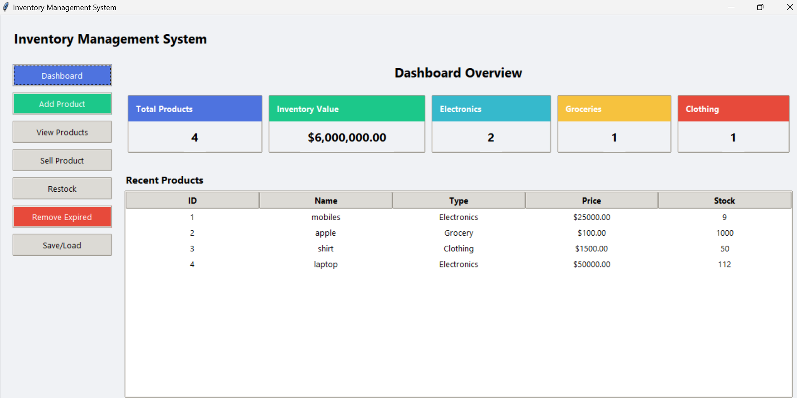
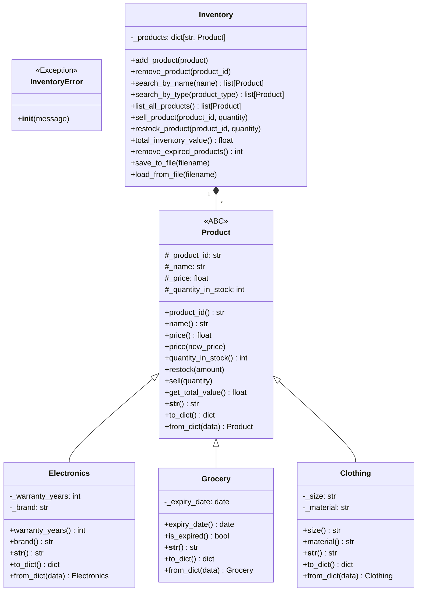
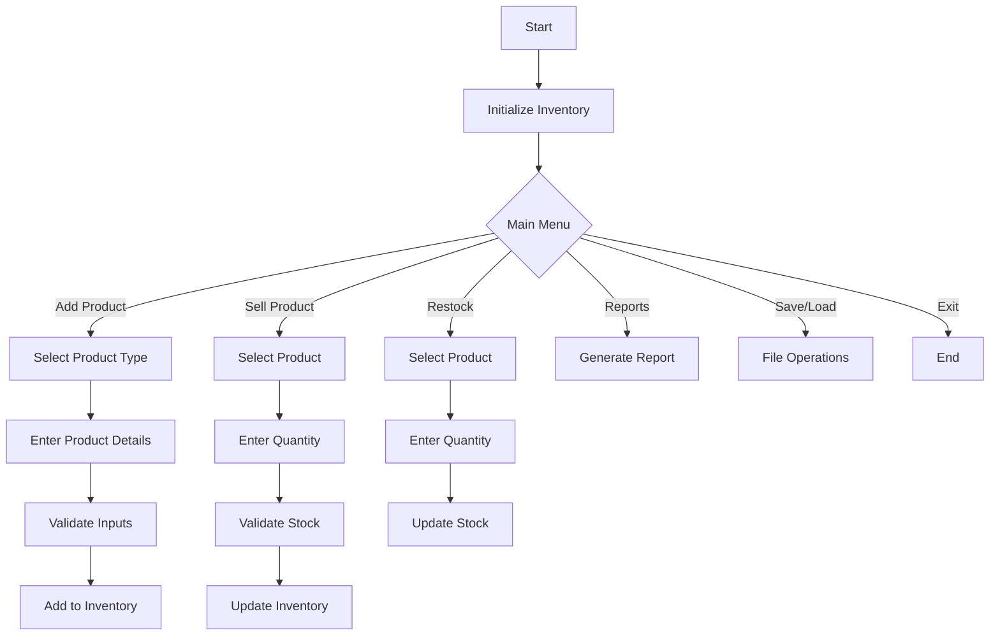

# Inventory Management System

 *Example dashboard UI*

A Python-based Inventory Management System using Object-Oriented Programming (OOP) principles to manage different product types (Electronics, Groceries, Clothing) with a modern graphical user interface.

## Table of Contents
- [Features](#features)
- [OOP Architecture](#oop-architecture)
- [Class Structure](#class-structure)
- [Workflow Diagram](#workflow-diagram)
- [Installation](#installation)
- [Usage](#usage)
- [File Structure](#file-structure)
- [License](#license)

## Features

- **Product Management**:
  - Add/remove products of different types
  - Sell products with stock validation
  - Restock inventory items
  - Automatic detection of expired groceries

- **Reporting**:
  - View all products with filtering
  - Dashboard with inventory statistics
  - Total inventory value calculation

- **Data Persistence**:
  - Save inventory to JSON file
  - Load inventory from saved file

- **User Interface**:
  - Modern dashboard with summary cards
  - Form validation and error handling
  - Responsive design

## OOP Architecture

The system follows SOLID principles with:

1. **Abstraction** - `Product` ABC defines common interface
2. **Encapsulation** - All classes protect their internal state
3. **Inheritance** - Product types extend base `Product` class
4. **Polymorphism** - Different product types implement their own logic

### Key Design Patterns:
- **Factory Pattern** - Creating products from dictionaries
- **Strategy Pattern** - Different behaviors for product types
- **Singleton Pattern** - Single Inventory instance

## Class Structure

### Core Classes



### Class Responsibilities

1. **Product (Abstract Base Class)**
   - Defines common interface for all products
   - Implements core inventory operations:
     - `restock()` - Add inventory
     - `sell()` - Remove inventory with validation
     - `get_total_value()` - Calculate item value
   - Requires subclasses to implement:
     - `__str__()` - Product display format
     - `to_dict()` - Serialization
     - `from_dict()` - Deserialization

2. **Electronics (Concrete Product)**
   - Adds electronics-specific properties:
     - `warranty_years`
     - `brand`
   - Implements type-specific serialization

3. **Grocery (Concrete Product)**
   - Manages perishable items with:
     - `expiry_date`
     - `is_expired()` method
   - Automatic expiry detection

4. **Clothing (Concrete Product)**
   - Handles apparel with:
     - `size`
     - `material` properties

5. **Inventory (Manager Class)**
   - Central inventory operations:
     - Add/remove products
     - Search/filter capabilities
     - Bulk operations (save/load)
   - Business logic:
     - Prevent duplicate products
     - Remove expired groceries
     - Calculate total value

## Workflow Diagram



## Installation

1. Clone the repository:
   ```bash
   git clone https://github.com/yourusername/inventory-system.git
   cd inventory-system
   ```

2. Install dependencies:
   ```bash
   pip install -r requirements.txt
   ```

3. Run the application:
   ```bash
   python main.py
   ```

## Usage

1. **Adding Products**:
   - Select product type (Electronics/Grocery/Clothing)
   - Enter product details
   - Submit to add to inventory

2. **Selling Products**:
   - Select product from inventory
   - Enter quantity to sell
   - System validates available stock

3. **Inventory Management**:
   - View all products with filters
   - Restock low inventory items
   - Remove expired groceries automatically

4. **Data Persistence**:
   - Save inventory to JSON file
   - Load previously saved inventory

## File Structure

```
inventory-system/
├── main.py                # Application entry point
├── inventory.py           # Core OOP classes
├── requirements.txt       # Dependencies
├── README.md              # This documentation
└── samples/
    ├── inventory.json     # Sample inventory data
    └── screenshot.png    # Application screenshot
```

## License

MIT License - Free for educational and commercial use

